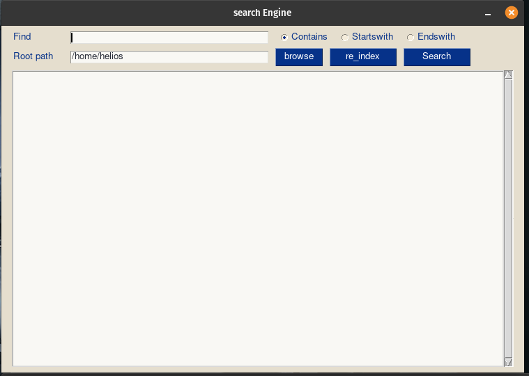

# File-Search with python

### find any file in your system with a simple gui interface

to run>> python file_search.py

#### **if you change the root path make sure to re index**

##### search results are saved to a text file in the same directory

